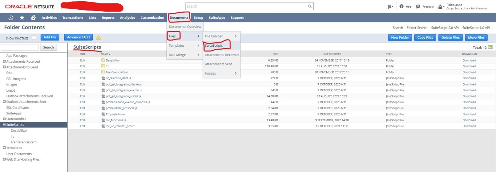
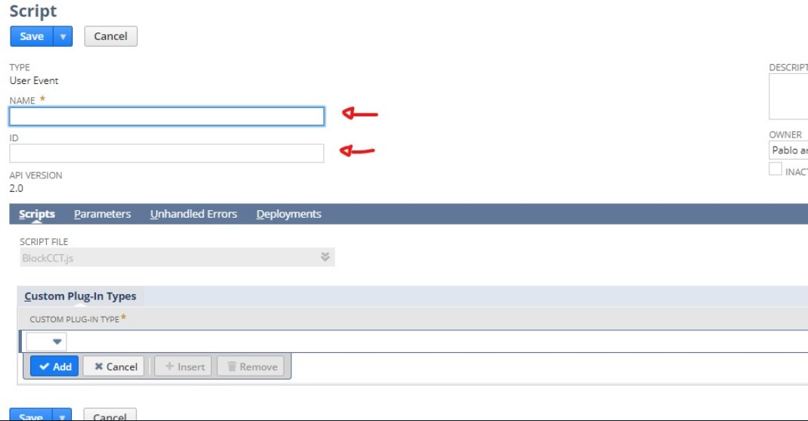
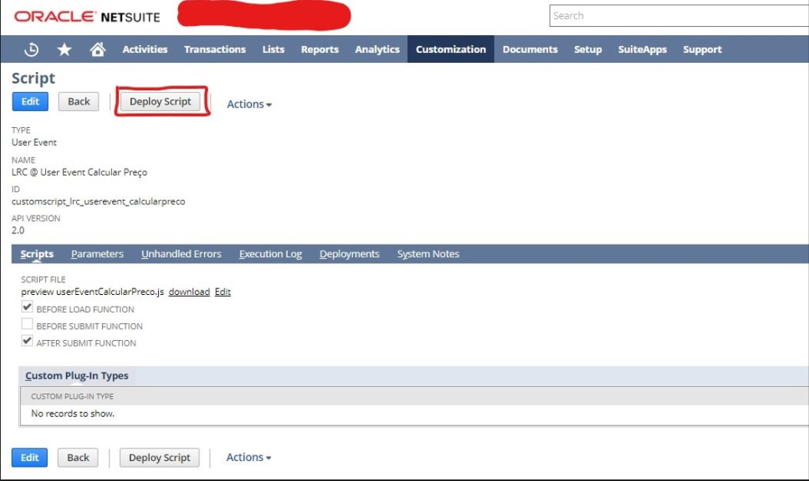

# Ambiente Netsuite
Para a visão de desenvolvedor, existem alguns elementos do ambiente cruciais para o bom trabalho.  
Para testar/aplicar um script, é necessário dar um upload em alguma pasta dos documentos/arquivos/suitescripts.  
Além disso, é necessário registra-lo e implementá-lo. Vale lembrar que apenas o clientScript não necessariamente
precisa ser implementado uma vez que ele é chamado em qualquer outro script server-side (Suitlet , userevent, etc).  
Observaremos o ambiente em seguida...

## Documentos

## Registros de Scripts

Para criar um registro, primeiro o script a ser implementado é selecionado (ele dever estar no documentos), e então iremos pra tela de criação.

Possivelmente haverá padrões de nomes e ids que deverá ser colocado dependendo da empresa em que você trabalha.
## Implementação de Scripts
Depois de criar o registro de script, é hora de implementa-lo.

Iremos, assim, para a tela de implementação.

- No campo *id*, segue o padão da empresa.  
- No campo *status*, deve ser colocado o valor *"released"/"liberado"* para que outras pessoas possam testa-lo também.  
- Em *Roles/Papéis*, é importante que seja selecionado para que qualquer cargo possa testa-lo também, salvo excessões de ocorrência de trabalho.  
- Na imagem acima, estamos fazendo o deploy de um User Event. Neste caso ou em alguns outros, aparece o campo *APPLIES TO/APLICADO A*, onde será
selecionado qual registro em que o script será executado.
## Registros de Dados
