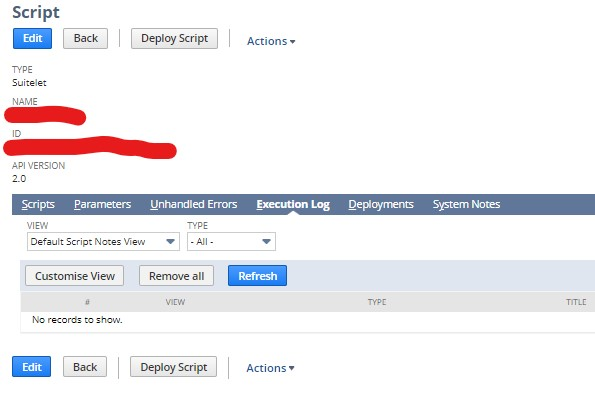

# Lista de Funções

Resumo de algumas principais funções que utilizamos frequentemente por bibliotecas.

Bibliotecas | Funções | Links
-------| -------- | -------
N/currentRecord | `currentRecord.get()`, `CurrentRecord.getValue()`, `currentRecord.setValue()` | [N/currentRecord Module](https://4847589-sb1.app.netsuite.com/app/help/helpcenter.nl?fid=section_4625600928.html)
N/file | `file.create()`,`file.load`,`File.save()` | [N/file Module](https://4847589-sb1.app.netsuite.com/app/help/helpcenter.nl?fid=section_4205693274.html)
N/log| `log.error()`,`log.audit()`,`log.debug()` | [N/log Module](https://4847589-sb1.app.netsuite.com/app/help/helpcenter.nl?fid=section_4574548135.html)
N/record | `record.create()`,`record.load`,`Record.save()`,`Record.getValue()`,`Record.setValue()` | [N/record Module](https://4847589-sb1.app.netsuite.com/app/help/helpcenter.nl?fid=section_4267255811.html)
N/search | `search.create()`,`Result.getValue()` | [N/search Module](https://4847589-sb1.app.netsuite.com/app/help/helpcenter.nl?fid=section_4345764122.html)
N/ui/serverWidget |`serverWidget.createForm()`, `ServerWidget.addField()`, `ServerWidget.addButton()`, `ServerWidget.addSublist()` |[N/ui/serverWidget Module](https://4847589-sb1.app.netsuite.com/app/help/helpcenter.nl?fid=section_4321345532.html)
N/url |`url.resolveRecord()`, `url.resolveScript()` | [N/url Module](https://4847589-sb1.app.netsuite.com/app/help/helpcenter.nl?fid=section_4358552918.html)
N/query |`query.create()`, `query.runSuiteQL()` |[N/query Module](https://4847589-sb1.app.netsuite.com/app/help/helpcenter.nl?fid=section_1510275060.html)
N/task | `task.create()` | [N/task  Module](https://4847589-sb1.app.netsuite.com/app/help/helpcenter.nl?fid=section_4345787858.html)

PS: Os links só podem ser acessados se você possuir conta no NetSuite.

## N/currentRecord
Utilizado no ClientScript. Serve para operar o registro atual do contexto em que o script está sendo rodado.
Exemplo Ilustrativo:
~~~javascript
/**
 *@NApiVersion 2.x
 *@NScriptType ClientScript
 */

define(['N/record', 'N/search', 'N/log', 'N/currentRecord', 'N/url'], function (record, search, log, currentRecord, url) {

    function pageInit(context) {
    }

    function ChecarDuplicidade(){
        var cocheira = currentRecord.get();
        var nome = cocheira.getValue({ fieldId: "" });
        console.log(nome);
        var cavalo = cocheira.getValue({ fieldId: "" });
        console.log(cavalo);
        search.create({
            type: "",
            filters: [["", "IS", cavalo]]
        }).run().each(function (result) {
            if (String(cocheira.id) != String(result.id)) {
                alert("Inconsistencia, cavalo já tem uma cocheira");
            }
            return true;
        });
    }

    return {
        pageInit: pageInit,
        ChecarDuplicidade: ChecarDuplicidade
    };
});
~~~javascript
## N/file
Serve para menipulção de arquivos. Você pode criar, carregar, excluir arquivos do netsuite (uma gama de tipos de arquivos, desde textos e pdfs até códigos).
Exemplo em cógido:
~~~javascript
function Arquivos(lista_id_file) {
        for (var i = 0; i < lista_id_file.length; i++) {
            var myFile = file.load({ id: lista_id_file[i] });
            if (myFile)
                log.audit("Arquivo existente", lista_id_file[i]);
            else
                log.error("Arquivo inexistente", lista_id_file[i]);
    }
~~~
Nesse trecho de código, ele recebe uma lista de ids e verifica se existem arquivos com aqueles ids no ambiente.

## N/log
Como utilizado acima, ele é equivalente ao console.log do javscript. Você pode verivicar seus logs na aba `Execution Log` do arquivo de implementação do seu código.

## N/task
Existem algumas aplicações que você pode chamar rodar um script a partir de outro.

Exemplo:
~~~javascript
## N/file
Serve para menipulção de arquivos. Você pode criar, carregar, excluir arquivos do netsuite (uma gama de tipos de arquivos, desde textos e pdfs até códigos).
Exemplo em cógido:
~~~javascript
function afterSubmit(context) {
        var lote = context.newRecord
        var scriptTask = task.create({
            taskType: task.TaskType.MAP_REDUCE,
            scriptId: 'customscript_rsc_faturamento_mr',
            deploymentId: 'customdeploy_rsc_faturamento_mr',
            params: {custscript_rsc_idlote: lote.getValue({ fieldId: 'id' })}
        });
        log.debug({ title: 'task.params', details: scriptTask.params });
        var scriptTaskId = scriptTask.submit();

        var scriptTask1 = task.create({
            taskType: task.TaskType.MAP_REDUCE,
            scriptId: 'customscript_rsc_mr_alternativo',
            deploymentId: 'customdeploy_rsc_mr_alternativo',
            params: {custscript_rsc_idlote2: lote.getValue({ fieldId: 'id' })}
        });
        log.debug({ title: 'task.params', details: scriptTask1.params });
        var scriptTaskId1 = scriptTask1.submit();
    }
~~~
No trecho acima, chamamos 2 map reduce para rodar depois que o registro é submetido. Neste caso, os map reduce não precisam nem estar programados para rodar a cada determinada quantidade de tempo. Setamos eles como evento único e eles rodarão toda vez que forem chamados.

